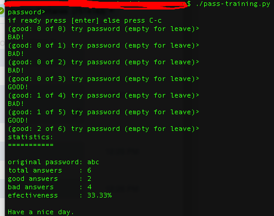

# pass-training
Password trainer console application, you can practice your whatever-password without the fear of being locked

## requirements

1. python3
1. bash or whatever shell that recognizes #!/usr/bin/env (either linux, Mac OS, cygwin, msys...)

check the file `pass-training.py` and modify it to if you have custom path for python 3 (or you want to use another version of python)

## usage

Just run the program and start to practice (first action is type/paste the password you want to practice)

```shell
shell$ chmod a+x ./pass-training.py #if you did't already do it
shell$ ./pass-training.py
```

Here's an example of use:


